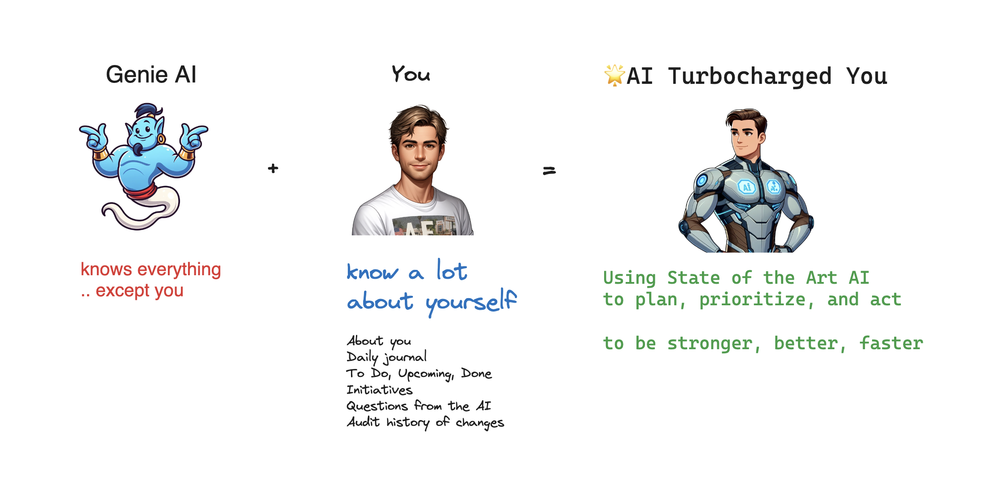

# 🧞‍♂️ Genai - AI That's Up to Speed on You, For You

This project is a personal AI co-pilot designed to help users reach their goals with up-to-date memory about you. [See project documentation here](https://vibehut.gitbook.io/genai/)

## Getting Started

To get started with the personal AI co-pilot, follow these steps:

1. Clone the repository to your local machine.
2. Go to `.env` and add in the OPENAI_API_KEY from OpenAI.
3. Open the `userState.txt` file and enter your personal information.
4. Open the `todoUpcomingDone.txt` file and add your tasks, upcoming events, and completed tasks.
5. Open the `daily.txt` file and write your daily journal.
6. Open the `initiatives.txt` file and write your goals and projects.

## I've filled in my files, let's run this

Install `npm install`

Run `npm ai`

## Usage

The personal AI co-pilot is a command line AI. Fill in the following files and then run `npm ai` or `node ai.js`. The response will be in the terminal.

- **User State**: The `userState.txt` file allows you to store your personal information, such as name, age, and location.
- **Task Management**: The `todoUpcomingDone.txt` file helps you keep track of your tasks, upcoming events, and completed tasks.
- **Daily Journal**: The `daily.txt` file allows you to write a daily journal to reflect on your day.
- **Initiatives**: The `initiatives.txt` file allows you to write about your goal and projects you're working towards.
- **Questions**: The `questions.txt` file allows you to log the questions the AI ask you and answer them. This helps the AI learn about you.
- **GitLog**: The `gitlog.txt` file is automatically appended to, it keeps track of your file changes helping the AI support your efforts as you work.

## Contributing

Contributions are welcome! If you have any suggestions or improvements, please submit a pull request.

## License

This project is licensed under the [MIT License](LICENSE).
